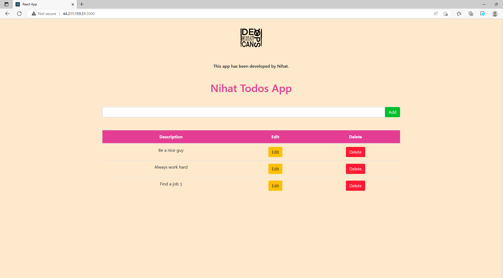
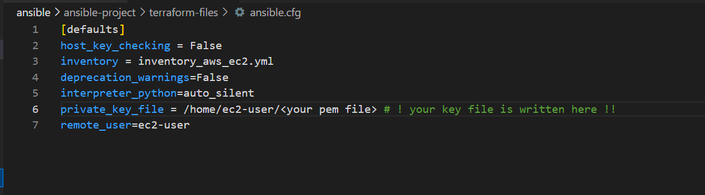
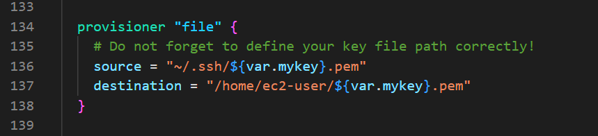
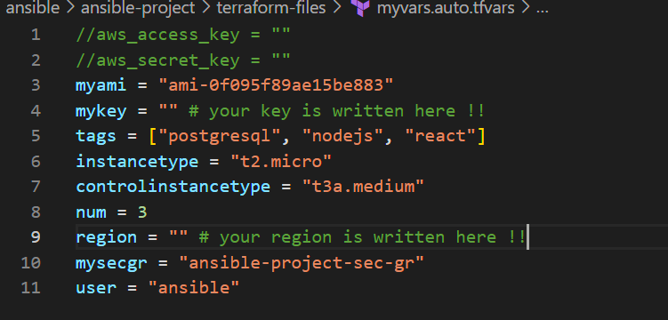
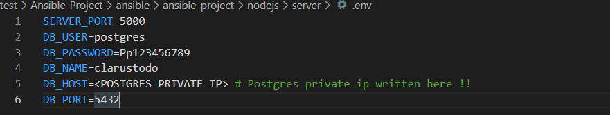
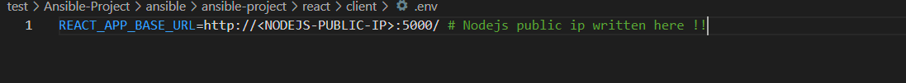

# Ansible-Project

# Description:  

This project published using by docker and ansible.

# Roadmap:

# Outcome:

# Note:

You must write your key.pem file in ansible-project/terraform-files/ansible.cfg

You must customize your key.pem path in asible-project/terraform-files/main.tf  line 136 

You must customize ansible-project/terraform-files/myvars.auto.tfvars

You must write database public ip in ansible-project/nodejs/server/.env file.

You must write server private ip in ansible-project/react/client/.env

